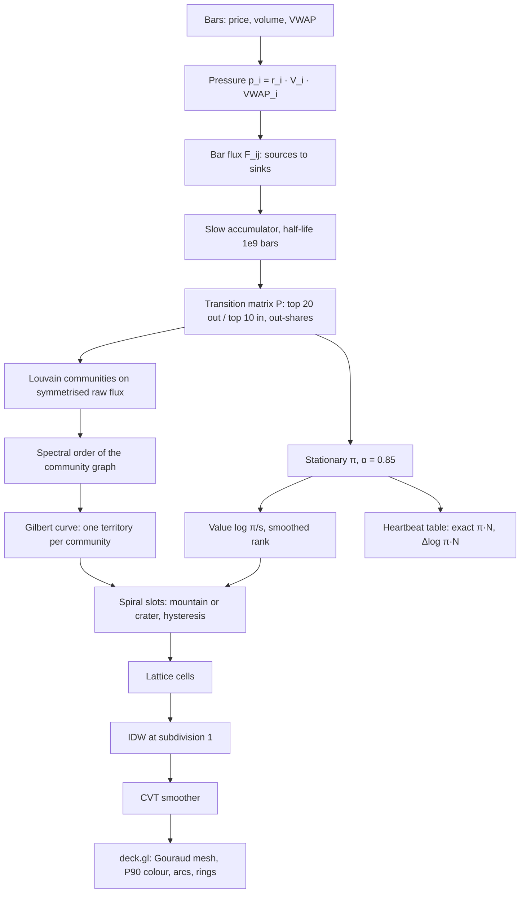

# MarketRank

MarketRank is a Markov-chain stationary-distribution solver over estimated stock-to-stock money flows. The
states of the chain are stocks, a transition i → j is the share of i's estimated outgoing dollar flow that goes
to j, and a stock's score is its stationary probability π_i: the long-run share of time a random walker who
follows the money spends at that stock. (PageRank is the best-known instance of the same idea, with links in
place of dollars; here it is only an analogy.) Fluxscape is its 3D landscape view.

## What we are trying to find out

MarketRank shows where money concentrates. The goal is to learn whether following it makes money, and to learn that honestly. It takes two steps:

- **Backfill**: download more past data. Today the model has about one year of daily prices. That is too short to tell a real pattern from luck, because in a single year almost any rule can look smart by accident. A backfill fetches 5–10 earlier years from the same data source into our lake. Nothing about the model changes; it just gets a much longer memory.
- **Walk-forward**: test the way you would actually trade, never peeking at the future.
  1. Stand at a past date and decide the rule using only data up to that day.
  2. Trade the next month and record the result.
  3. Step one month forward and repeat, until today.

  Every result therefore comes from a period the model had never seen.

**How they fit together.** The backfill gives us many years to walk through. The walk-forward then answers one plain question: if we had followed MarketRank's signals month by month, would the portfolio have beaten simply holding the current mix, after trading costs?

- **If yes, consistently:** we build the optimizer that moves the portfolio, and paper-track it before anyone trusts it.
- **If no:** we have learned that cheaply, without risking money, and we look for better flow data, such as ETF flows or 13F.

This is milestone 3. Its spec is `docs/superpowers/specs/2026-10-02-marketrank-m3-design.md`.

Stocks are ranked by their MarketRank score π·N (1 = an average active stock) and, optionally, by hotness.
Design: `docs/superpowers/specs/2026-10-01-marketrank-design.md`.

## MarketRank model

The default model (`CoreParams::market_rank()`, `--marketrank`) solves for the stationary distribution π of a
damped Markov chain over the paired stock-to-stock dollar flows T, using the MarketRank Condition (MRC):

```
r_i = (1 − p) · Σ_{j ∈ B(i)} P_i(r_j) + p / N,   P_i(r_j) = r_j · T_{j→i} / Σ_k T_{j→k},   p = 0.15
```

B(i) is the set of stocks sending money to i, so each stock passes its probability on in proportion to the
out-share of its dollar flow, and p/N is the teleport (α = 1 − p = 0.85). T is the dollar flux accumulated over
the whole data window (slow half-life 1e9 bars), with no lift, no self-retention and the default two-sided
pruning (top 20 out-edges per row, top 10 in-edges per column). A stock that passes nothing on (an empty row)
is a dangling node: its probability teleports uniformly.

The **MarketRank score** is π_i·N_active (1 = average) and the **heartbeat** is its pulse,
Δlog(π_i·N_active) between the current bar and the previous one (so a change in the number of active stocks
alone is no pulse). Under this preset the forecast column "score+1" contrasts the cumulative π with the 3-bar
fast chain, so it reads "where the newest flow points against the whole window", not a one-bar drift.

Worked example (three stocks, T in dollars):

| From → To | A | B | C |
|---|---|---|---|
| A | – | 500K | 100K |
| B | 200K | – | 1M |
| C | 750K | 400K | – |

Row-normalizing T gives P; the damped power iteration from the uniform start gives, after 7 iterations,
B 0.35980, C 0.34770, A 0.29248, and converges to B 0.36016, C 0.34665, A 0.29319. B ranks first: it
receives the most money relative to what its senders pass on. The test suite checks both results through the
solver and through the pipeline's transition builder.

### On real data


The same computation on a slice of the real graph: the 1d bar of 2026-10-01 (replay of the 10,000-ticker
snapshot, 250 daily bars, 6,188 active stocks). The slice is the top-π stock, MU, and its five strongest
partners by raw flux in both directions. The arrows are the dollar flux among them, accumulated over the data
window. These are **estimated** flows, inferred from public price and volume bars; they are not observed
account-level trades between holders of the two stocks. "slice π" is the MRC re-solved on these six stocks
alone, with p = 0.15.

MU absorbs a third of the slice's probability (0.333) even though, within the slice, it sends more ($10.0B) than
it receives ($7.5B). The chain counts out-shares, not net dollars, and every partner sends MU the largest share
of its slice outflow (41% for SOXS up to 74% for SPCX). The rest of the ranking follows where MU sends its money:
about a quarter each to MSFT, SOXS and AAPL and only 9% to TSLA. SOXS also gets 20% of TSLA's outflow, so it
edges out AAPL. TSLA ranks second of these six in the full graph (π·N 214.6) but last in the slice: within these six it
receives the smallest shares, so its global standing rests on money from stocks outside the slice.

Reproduce it with `./build/marketrank --mode replay --export-slice 6` (writes
`docs/img/marketrank-slice.json`; `--slice-out PATH.json` to change it; replay only), then
`python3 scripts/render_slice.py`.

### Rank tables

`./build/marketrank --mode replay` prints the TOP and BOTTOM MARKETRANK tables (rank, ticker, sector,
MarketRank π·N, heartbeat Δlog(π·N), hotness h, score+1), sorted by π with ties to the lower index, the same
order as `/api/top`. The stocks that receive no flow all tie at the teleport floor; the bottom table folds them
into one line ("N stocks tied at the teleport floor (π·N = x)") and lists the lowest names above it.
`--rank-by hotness` sorts by h instead (HILLS and VALLEYS). `--money-flow`, `--legacy` and `--defaults`
(`CoreParams{}`) select the other presets.

**Limitation.** On the real data about 71% of the active stocks sit at the teleport floor (70.9% on the
2026-10-01 bar): no kept edge points at them, so they receive only the teleport share and tie at
π·N ≈ 0.15. The ranking is informative at the top and in the middle; the floor is one large tie.

## Build and test

```bash
cmake -S . -B build -DCMAKE_BUILD_TYPE=Release
cmake --build build -j
./build/marketrank_tests
```

## Run

```bash
./build/marketrank --mode synthetic                          # no keys needed
cp .env.example .env                                        # add Alpaca keys
./build/marketrank --mode alpaca --universe-size 10000       # build/reuse 10K liquidity snapshot, sync, solve
./build/marketrank --mode replay                             # cached data, latest snapshot (or --universe sp500)
./build/marketrank --mode replay --eval --eval-bars 120      # compare A-E settings (floor, Gini, coherence, IC)
./build/marketrank --mode replay --rank-by hotness --money-flow  # size-relative hotness, the earlier serve default
./build/marketrank --mode replay --legacy                    # milestone-1 behaviour
./build/marketrank --mode replay --shock NVDA:-10 --top 8       # counterfactual: add an extra -10% return to NVDA at the last bar, see who absorbs it
./build/marketrank --mode replay --export-slice 6           # graph slice of the latest bar as JSON (README figure)
python3 scripts/render_slice.py                             # that JSON -> docs/img/marketrank-slice.svg
./build/marketrank --help                                    # all switches (--pressure, --lift, --k-in, ...)
./build/marketrank --migrate-cache                           # one-time: import the old data/cache CSVs into data/lake
./build/marketrank --maintain                                # compact partitions and apply data/lake/retention.json
./build/marketrank --mode alpaca --refetch-full             # one-time: refetch every ticker's full stored history (repairs old split/dividend bases)
./build/marketrank --sync-sectors --universe snapshot  # fill sectors from SEC EDGAR SIC codes (run on its own)
python3 scripts/fetch_sp500.py                              # refresh the S&P 500 list
```

`--threads N` sets OpenMP threads; results are bit-identical for any thread count.
`data/universe/include.csv` / `exclude.csv` (one ticker per line) override the universe filters.

Sectors: only S&P 500 names have a GICS sector in the snapshot. `--sync-sectors` fetches SEC EDGAR SIC
codes for every ticker of the newest snapshot, as rank loads it in replay mode (honours `--universe`; `--universe-size` is ignored, the cache is keyed by ticker), into
`data/sectors/sec_sic.csv` and prints per-sector counts and the % Unclassified before and after. It
needs `SEC_USER_AGENT="Your Name your@email"` in `.env` (SEC requires a contact), no Alpaca keys, and
does not touch the lake. It waits at least 150 ms between requests (under SEC's limit of 10 per second),
caches for 90 days and resumes if interrupted; run it separately from `--mode alpaca`. At load time every
sector is filled in the order S&P GICS, SEC SIC, then `ETF/Fund` (name heuristic and `funds.csv`), then
`Unclassified`; snapshot CSVs are unchanged. With the current cache 4.6% of the tickers are Unclassified.

Advisory and experimental. The flux is inferred from price and volume co-movement,
not observed order flow.

## Landscape UI (Fluxscape)

```bash
./build/marketrank --serve --mode replay            # http://127.0.0.1:8765 (marketrank preset)
./build/marketrank --serve --mode synthetic --port 9000
scripts/ui_smoke.sh                                # headless-Chrome smoke test + screenshot (MODE=replay for real data)
```


The page shows a triangulated landscape of **π relative to size**: the height is log(π_i / s_i), where s_i is the stock's size share (trailing median dollar volume over the sum across active stocks, the size `HotRef::Size` uses). A hill attracts more money than its size predicts, a valley less, and 0 is exactly as predicted; stocks without a size get no height. Ranking and the table show π itself: the landscape is a reading aid, the table is the truth. Note that the many stocks at the teleport floor get the same π whatever their size, so small floor stocks read slightly above 0 here (a mild relief, not a signal). The same value orders the stocks inside each territory and decides mountain or crater. The legend under the landscape names the quantity.

**The UI is fixed.** It has no model or landscape options. Its settings are fixed defaults: the marketrank preset, the height π relative to size log(π/s), flux-community territories, the CVT smoother (12 iterations, λ = 0.6) and subdivision 1. The page never calls `/api/params`. Developer knobs exist only on the CLI (`--money-flow`, `--h-ref`, ...) and in the API (`POST /api/params`: `value` `pi_rel_size|pi|hotness`, `territory`, `smoother`, IDW, ...). The truth table is the exact π·N with the heartbeat Δlog(π·N).

**Left panel.** The status line reads "MarketRank · replay 1d · N stocks · date". The panel lets you:
- scrub or play through the last 300 bars, or follow the latest;
- set the height scale (visual only), the arc count and the labels;
- see your portfolio's π·N;
- apply a shock on the latest bar (`TICKER`, ±%) to show the Δh landscape of who absorbs the money and who loses it.

The table at the top right, "MarketRank top 10 · π (exact)", shows the ten highest π·N with their heartbeat and recent history. Tooltips show π·N, the heartbeat, π, h and the displayed height value. On the real replay data about 85% of stocks keep their cell between refreshes, and about 74% keep their community at a refresh. How every stage works is described next.

## Landscape algorithms (Fluxscape)

Each served bar runs the model and then the landscape pipeline below. Everything is deterministic for any
thread count. The defaults are those of `LandscapeParams{}` (`src/geom/landscape.hpp`) and the serve path in
`src/main.cpp`; under the fixed UI they cannot be changed from the page.



### 1. From the flux graph to the slow transition matrix P

*What.* Each bar, every active stock gets a pressure p_i = r_i · V_i · VWAP_i (its return times its dollar
volume; dollar pressure under the marketrank preset). Stocks with p < 0 are sources (net sold) and p > 0 sinks
(net bought). A source's outflow |p_i| is split over the sinks in proportion to p_j · (1 + λ·ρ_ij), where ρ_ij
is the correlation of the two stocks' returns over the previous 60 bars:
F_ij = |p_i| · p_j (1 + λρ_ij) / Σ_k p_k (1 + λρ_ik). Only the 256 sinks with the largest pressure are
candidates and each source keeps its 64 strongest edges; the row and column totals stay exact. The bar flux
is added to a slow accumulator that decays by 2^(−1/half-life) per bar (half-life 1e9 bars, so effectively a
sum over the window; rows capped at 256 edges). P keeps each row's top 20 edges plus each column's top 10
(`k_out`, `k_in`), with no lift and no retention, and row-normalizes the kept raw flux:
P_ij = F_ij / Σ_{k kept} F_ik. A row with no kept edge is empty (dangling) and teleports.

*Parameters.* λ = 1 (`--lambda`), correlation window 60, 256 candidate sinks, 64 sinks per source, row cap
256, `k_out` 20, `k_in` 10, α = 0.85, liquidity floor: trailing 20-bar median dollar volume ≥ $1M, stale
after 5 bars without a close.

*Why.* Prices and volumes are public; who bought from whom is not. Pairing net sellers with net buyers in
proportion to size and co-movement gives an estimate of where money went, and pruning keeps memory linear in
N. P is the chain that π is solved on, and the same P (its raw values) feeds the community detection and the
arcs below.

### 2. Louvain communities

*What.* The community graph is the symmetrised raw flux W = R + Rᵀ, where R holds P's off-diagonal kept
edges among active stocks (raw dollars, not probabilities). Louvain runs in two phases: local moves, then
aggregation, repeated until nothing moves. It is made deterministic by visiting nodes in index order,
summing neighbours in column order, accepting a move only for a modularity gain above 1e-12, breaking ties
to the lowest community id, and numbering communities by their smallest member. Communities with fewer
than 8 stocks (`min_size`) merge into the neighbour they share the most flux with. Those with no neighbour
go into one pooled **loose** community, which is placed last. At most 256 communities are kept.

Re-clustering happens every 5 bars (`recluster_bars`). Each re-cluster warm-starts phase 1 from the current
labels: stocks that share a label start together and new stocks start alone. The very first clustering is
re-run from its own result until it reaches a fixed point (at most 4 rounds). New communities are matched to
old labels greedily by overlap. A pair counts when its Jaccard overlap is ≥ 0.3 or ≥ 60% of the new
community lies inside the old one. Matched communities keep their label and their relative layout order, and
unmatched ones get fresh labels. Between re-clusters a newly active stock joins the community of its
strongest labelled neighbour (else loose), and an inactive stock leaves. In serve mode the first 5 bars
(`warmup_bars`) only feed the model, with no landscape and no clustering.

*Parameters.* Resolution 1.0, `min_size` 8, max 256 communities, re-cluster every 5 bars, Jaccard 0.3,
containment 0.6, warm-up 5 bars.

*Why.* Territories should group stocks that trade money among themselves, so the flux arcs stay short and a
community reads as one landform. The warm start and label matching keep the map from reshuffling every time
it re-clusters.

### 3. Spectral order of the community graph

*What.* Communities are ordered along a line so that strongly connected ones end up adjacent. The input is
the K × K matrix of flux between communities. Disconnected sets are split into their connected components
first, the largest stock count first. A connected set is split by the Fiedler vector of its normalised
Laplacian, found by power iteration on I + D^(−1/2) W D^(−1/2) with the trivial vector √d deflated (500
iterations, sign fixed so the largest-magnitude entry is positive). The communities are sorted by their Fiedler value
and cut where the cumulative stock count is closest to half (a balanced bisection), and each half is ordered
recursively. Then the halves are oriented: a half is reversed when its far end has more flux with the other
half than its near end, so the two strongest-tied ends meet in the middle. The loose community always goes
last.

*Why.* The Gilbert curve in the next step turns this order into 2D, and neighbours on the curve are
neighbours on the map, so communities that trade with each other become neighbouring territories. The
orientation step matters because a bisection by itself fixes which communities go in each half but not
which way round each half is laid.

### 4. Gilbert curve and territory sizing

*What.* The lattice cells are visited along a generalised Hilbert curve (the "gilbert2d" construction). It
covers any cols × rows rectangle, not only powers of two, and consecutive cells are always neighbours.
Communities take consecutive runs of the curve in layout order, so each territory is one contiguous region.
A community with a_g active stocks gets a_g cells plus a share of the C − A spare cells (C cells, A active
stocks): ⌊a_g·(C − A)/A⌋, with the leftover spare cells going one each to the largest remainders (ties to
the lower group).

*Why.* A space-filling curve keeps regions compact and preserves the 1D order's locality. Largest-remainder
sizing makes the areas proportional to the stock counts and sum exactly to the lattice.

### 5. Inside a territory: spiral, mountain or crater, hysteresis

*What.* The territory's cells are ordered as a spiral around their centre (the mean of the cell centres):
by ring ⌊distance⌋, then by angle from −π, then by cell index. Stocks are ranked by a smoothed value:
0.5 × the current landscape value + 0.5 × the previous frame's smoothed value (`order_smoothing` 0.5;
non-finite values rank as 0). If the community's median value is at least the median over all active stocks
it is a **mountain**, and the highest stocks take the centre slots. Otherwise it is a **crater**, and the
lowest stocks take the centre. The outer slots stay empty.

Hysteresis keeps stocks in place. A stock keeps its previous cell if four conditions all hold: it was active
and in the same community last frame, the lattice size is unchanged, the cell is still inside its territory,
and that cell's spiral slot is within max(2, 0.15 × territory cells) of the stock's new ideal slot
(`rank_tolerance` 0.15). Conflicts resolve in three passes in rank order: kept cells, then the ideal slot if
it is free, then the nearest free slot (ties to the lower slot).

*Why.* Centre-out ranking turns each community into one readable landform. Smoothing the rank and keeping
cells within a tolerance means a small change in rank is a small move or no move, so the map does not
flicker from bar to bar.

### 6. Lattice size

*What.* cols = ⌈√A⌉, rows = ⌈A / cols⌉ for A active stocks. For the 6,188 active stocks of 2026-10-01 that
is 79 × 79 = 6,241 cells, with 53 spare.

*Why.* It is the smallest near-square grid that holds every active stock, so almost every cell is a stock
and the spare cells are spread over territories by step 4.

### 7. IDW at subdivision 1

*What.* The raster has `subdivision` pixels per cell side. At the fixed subdivision 1 the raster is the
lattice itself, so each mesh vertex is a cell centre. An occupied cell takes its stock's value exactly. An
empty cell takes the inverse-distance-weighted mean (weights 1/d², power 2) of the occupied cells in the
(2·3 + 1)² window around it (radius 3 cells). If the window holds no stock, the cell takes the value of the
nearest stock, found by a multi-source 8-connected BFS seeded in ascending cell order. If the weights
underflow or overflow, it takes the nearest stock in the window.

*Parameters.* Subdivision 1, power 2, radius 3 (`idw_power`, `idw_radius`, `subdivision` in the API).

*Why.* Each stock sits on a vertex with its exact value, and the few empty cells get a sensible neighbour
average. The BFS fallback and the underflow guard mean a raster never contains NaN.

### 8. The smoother: CVT-weighted field smoothing (default) and Gaussian

*What.* The default CVT smoother is a Lloyd-style relaxation on the raster grid. Each iteration moves every
vertex toward the density-weighted mean of its 3 × 3 neighbourhood:
z' = (1 − λ)·z + λ·Σ a·ρ·z / Σ a·ρ, with area weights a = 1 for the centre and edge neighbours and 0.5 for the
diagonals. The density is ρ = ε + |z| with ε = 0.1 × P90(|z|) (ε = 1 if that P90 is 0). Tall neighbours
pull a vertex toward them, which fills the dip IDW leaves around an isolated peak. It does not conserve the
mean height. The Gaussian alternative (`"smoother":"gaussian"` in the API) is a separable Gaussian with
σ = 1 cell × subdivision and radius ⌈3σ⌉, with edge windows renormalised. `"none"` turns smoothing off.

*Parameters.* CVT: 12 iterations, λ = 0.6, ε fraction 0.1 (`cvt_iterations`, `cvt_lambda`, `cvt_eps`).
Gaussian: σ = 1.0 (`smooth`).

*Why.* The eye reads a smooth surface better than a field of needles. Smoothing is display-only: stocks do
not move, the tooltip, the top-10 table and `/api/top` show the exact values, and changing only display
settings redraws the cached frames without recomputing the model.

### 9. Display height, and π versus hotness

*What.* The landscape value `hdisp` of a stock is, by `value`:
- `pi_rel_size` (the default under the marketrank preset): log(π_i / s_i), with s_i the size share;
- `pi`: log(π_i · N_active), 0 = average;
- `hotness`: the signed log of h, sign(h)·log(1 + |h|) (`height` `signed-log`; `linear` gives h itself).

Hotness is h = π / reference − 1. Under the marketrank preset the reference is uniform, so h = π·N − 1 is
just a shifted π·N. Hotness differs from π only under the other references (`--h-ref size|longrun|netflow`).
The shock view uses the signed log of Δh.

*Why.* π spans orders of magnitude, so a log height keeps both the giants and the middle visible. Dividing by
size shows where money goes beyond what size alone predicts, which raw π (dominated by the largest stocks)
cannot show.

### 10. Rendering

*What.* The terrain is one deck.gl `SimpleMeshLayer`: one vertex per raster sample, two triangles per grid
square, normals from central differences, and per-vertex colours interpolated across each triangle (Gouraud
shading). The colours are diverging: red above 0, blue below, near-white at 0. They saturate at ±vmax, where
vmax is the P90 of |z| sampled at the stock cells (floored at 1e-9; under `value` `pi` the tied floor stocks
are left out). The height is clip·tanh(z·scale / clip), with scale = 0.25·max(cols, rows) / vmax × the
height-scale slider and clip = 0.4·max(cols, rows), so outliers become plateaus rather than needles.

The overlays:
- **Arcs.** The server sends the 2000 strongest kept edges of P by raw flux. The page draws the first n of
  them (slider, default min(2 × stocks, 150)), 0.5 to 2 px wide by flux, orange to gold.
- **Portfolio rings.** Green rings of radius max(0.6, 0.012·max(cols, rows)) + 1.5 × weight, drawn without a
  depth test so that they stay visible.
- **Shock Δh view.** `POST /api/shock` re-steps the last bar with an extra return on the named stock. Δh is
  drawn through the same IDW and smoother, with its colour scale set by the P90 of |Δh| over the stocks that
  were not shocked.
- **Heartbeat table.** `/api/top?n=10&bars=30&by=pi` gives the ten highest exact π·N. Each row shows the
  rank, a move marker against the previous rank, the ticker, the sector, π·N, the heartbeat Δlog(π·N) and a
  30-bar sparkline. A row pulses when its value changes.

*Why.* A per-vertex mesh is cheap at 6,000+ vertices and shows each stock's value at its own vertex. A
robust P90 scale with a soft clip keeps a handful of extreme stocks from washing out the rest. The table is
always the unsmoothed truth.

## How it works

1. **Universe.** Start from every tradable US stock on Alpaca. Drop warrants, units, rights and
   ETF-like products. Rank what's left by median daily dollar volume and keep the top N (default
   10,000). Your portfolio holdings are always included.
2. **Buying and selling pressure.** For each bar, each stock's pressure is its return times its dollar
   volume (`r · V · VWAP`, the marketrank default; `--pressure sqrt` uses `r · √(V · VWAP)`, the
   `CoreParams{}` default). Positive pressure means net buying (a sink); negative means net selling
   (a source). `--pressure relative` instead uses how unusual volume is against its own normal
   (`r · V / ADV`, with V/ADV capped at 5); `--vol-scale` additionally divides each return by the stock's
   trailing 20-bar volatility so calm instruments are not structurally cold. Stocks whose median dollar
   volume is under $1M stay out of the graph.
3. **Money flux, with no fitted model.** Each source's outflow is split across the sinks in
   proportion to their pressure, and tilted toward stocks it moves with (rolling return
   correlation). The result is a directed, weighted graph: edge i→j is the estimated money moving
   from selling i into buying j. Only the strongest edges are stored, so memory grows with N, not N².
4. **Memory of the flow.** Edges and totals build up with exponential decay: under the marketrank preset a
   slow memory with half-life 1e9 bars (the whole window) for the equilibrium and a fast memory (3 bars) for
   the newest flow; the other presets use a 20-bar slow half-life. Bars are stored in a DuckDB-managed,
   Hive-partitioned Parquet lake (`data/lake`), with month partitions and a retention policy.
5. **Keep the real structure.** Keep each stock's strongest outgoing and incoming edges. The other presets
   can also subtract the flow you'd expect from size alone ("big buyers meet big sellers", `--lift`) and let
   net buyers retain part of what flows in (`--retention`); the marketrank preset does neither.
6. **Markov chain → stationary distribution.** Normalize each stock's kept edges into transition
   probabilities (out-shares) and solve for the stationary distribution π of the damped chain. π is where
   the market's money settles if the current flow pattern continues.
7. **Hotness.** Hotness `h = π / reference − 1`: hills (h > 0) are where money accumulates and
   valleys (h < 0) are where it drains. The reference can be uniform (the marketrank default), size, each
   stock's own long-run normal, or a bounded net-flow ratio `(in − out)/(in + out + κ)`.
8. **Forecast.** Push the stationary distribution one, four and eight bars forward through the fast flow,
   and add its recent drift. The result is a score for where the money is heading next.
9. **Evaluate before trusting.** `--eval` compares every setting on historical data. It reports
   how much of the graph is dead, how concentrated π is, whether flows cluster by sector, and
   whether the scores rank next-bar returns (information coefficient).
10. **Landscape and next milestones.** The stationary distribution is drawn as the Fluxscape landscape
    (above). Next, the portfolio optimizer moves your holdings "uphill", and the hourly, daily and weekly
    suggestions are paper-traded so their real profit and loss is tracked.

Shock mode (`--shock TICKER:SIZE`) replays the last bar twice, once as is and once with an extra SIZE% return, at normal volume, added to the named stocks' pressure, and reports which stocks gain or lose hotness.
