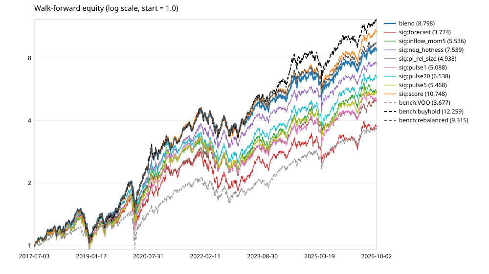
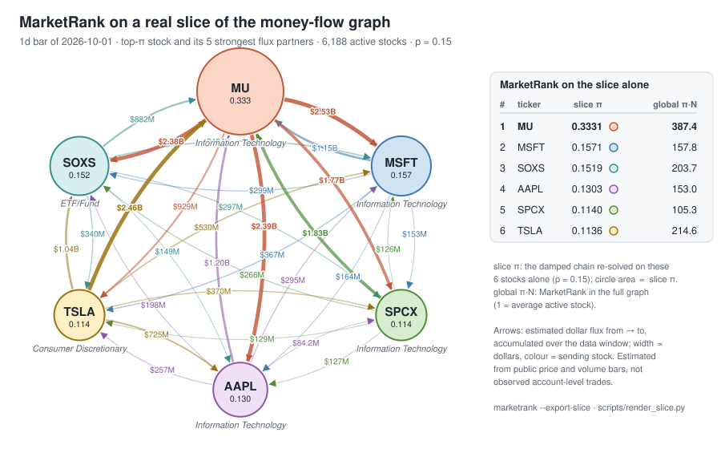
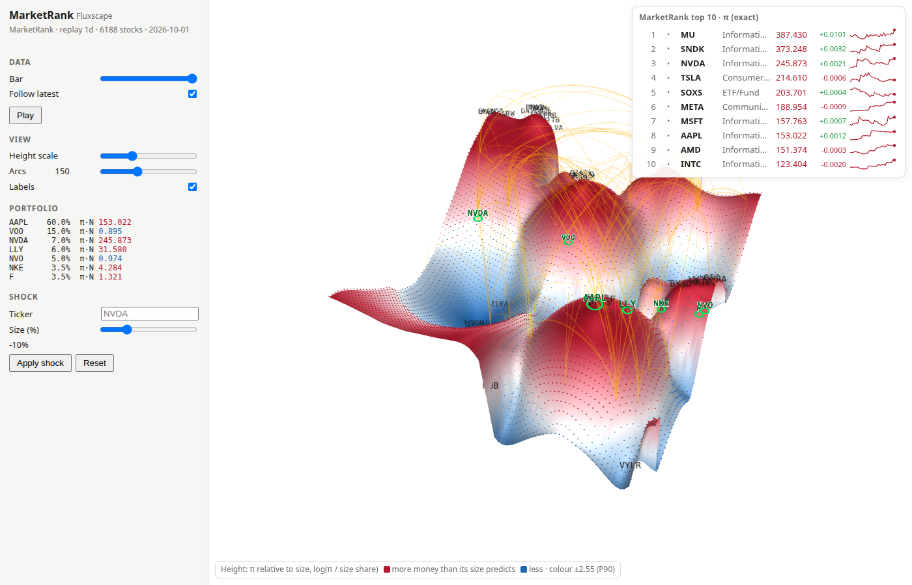
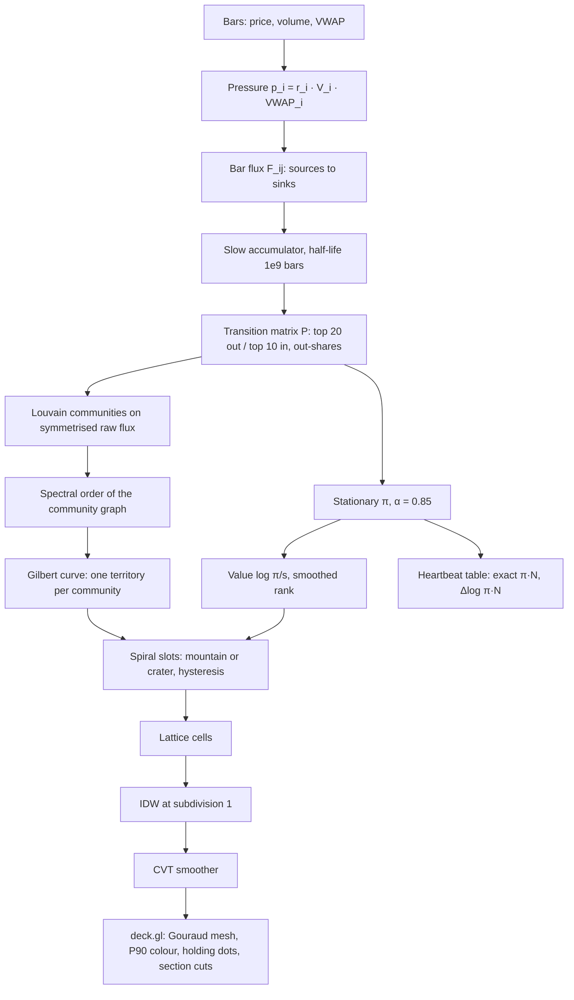

# MarketRank

MarketRank is a Markov-chain stationary-distribution solver over estimated stock-to-stock money flows. The
states of the chain are stocks, a transition i → j is the share of i's estimated outgoing dollar flow that goes
to j, and a stock's score is its stationary probability π_i: the long-run share of time a random walker who
follows the money spends at that stock. (PageRank is the best-known instance of the same idea, with links in
place of dollars; here it is only an analogy.) Fluxscape is its 3D landscape view.

## What we are trying to find out

MarketRank shows where money concentrates. The goal is to learn whether following it makes money, and to learn that honestly. It takes two steps:

- **Backfill**: download more past data. Today the model has about one year of daily prices. That is too short to tell a real pattern from luck, because in a single year almost any rule can look smart by accident. A backfill fetches 5–10 earlier years from the same data source into our lake. Nothing about the model changes; it just gets a much longer memory.
- **Walk-forward**: test the way you would actually trade, never peeking at the future.
  1. Stand at a past date and decide the rule using only data up to that day.
  2. Trade the next week and record the result.
  3. Step one week forward and repeat, until today.

  Every result therefore comes from a period the model had never seen.

**How they fit together.** The backfill gives us many years to walk through. The walk-forward then answers one plain question: if we had followed MarketRank's signals week by week, would the portfolio have beaten simply holding the current mix, after trading costs?

- **If yes, consistently:** we build the optimizer that moves the portfolio, and paper-track it before anyone trusts it.
- **If no:** we have learned that cheaply, without risking money, and we look for better flow data, such as ETF flows or 13F.

**What we found (2026-10-02).** The answer on public daily bars is no, and we know why.

- **Walk-forward:** following MarketRank lost 3–5% a year against simply holding, in every run; only a small
  short-term reversal is real, and it is too small to pay for trading ([Results](#results-m3a-2026-10-02)).
- **Observed flows (13F):** against the holding changes that institutions report to the SEC, the estimated
  flows get the senders and receivers roughly right but say nothing about who pairs with whom; plain trading
  volume ranks the observed destinations better ([Observed flows from 13F](#observed-flows-from-13f)).
- **Communities:** the flux clusters behind the landscape last only about as long as the flow window that
  defines them, so the map is a reading aid for recent flows, not a stable structure.

So the bottleneck is the flow data, not the solver: the next step is data that observe pairing more directly.

Weekly is the primary test: any edge from flow pressure should show within about a week, and beyond that flows mix with unrelated news. Monthly is kept as a comparison. This is milestone 3. Its spec is `docs/superpowers/specs/2026-10-02-marketrank-m3-design.md`.

Stocks are ranked by their MarketRank score π·N (1 = an average active stock) and, optionally, by hotness.
Design: `docs/superpowers/specs/2026-10-01-marketrank-design.md`.

### Results (M3a, 2026-10-02)

**The answer is no.** Over nine years of out-of-sample weekly decisions, following MarketRank's signals did not
beat simply holding the current mix, and the pre-registered gate fails.

- **Data.** The backfill reaches 2016-06-27, which gives 2,582 daily bars for 10,000 tickers (a 471 MB lake).
  After the 252-bar warm-up there are 483 weekly rebalances, from 2017-06-30 to 2026-09-25.
- **Predictive signal.** There is a small but persistent one: the hotness reversal. Names that are cold today
  do slightly better over the next 1 to 20 days than hot ones.
  - IC +0.006 at 1 day (t = 3.2), positive in 8 of 10 years. The large caps give the same, t = 3.4.
  - The score and π-relative-to-size rank the other way round: π/size has IC −0.009 (t = −4.6) and is
    negative in 8 of 10 years.
  - The heartbeats (pulse1, pulse5, pulse20) and the forecast are noise.
  - The relative-pressure run gives t = 1.4 at 1 day for the reversal. That run is the marketrank preset with
    `--pressure relative`, not the legacy +A relative configuration behind the earlier one-year t ≈ −11 (k_in = 0,
    min_dv = 0, a different universe and eligibility). Both the configuration and the sample changed, so this run
    neither replicates nor refutes the earlier result.
- **Portfolio.** The effects are far too small to pay their way in a 20% tilt over 10 names:

  | run (blend vs buy-and-hold) | ann. excess | 95% CI | IR | max DD | years + | DSR_excess (c3) |
  |---|---:|---|---:|---:|---:|---:|
  | weekly, 10 bps (main) | −4.09% | −7.73 .. −0.67% | −0.63 | 31.2% | 4 of 10 | 0.00003 (FAIL) |
  | weekly, 0 bps | −3.91% | −7.55 .. −0.51% | −0.60 | 31.2% | 4 of 10 | 0.00004 (FAIL) |
  | weekly, 25 bps | −4.36% | −8.00 .. −0.91% | −0.67 | 31.2% | 4 of 10 | 0.00002 (FAIL) |
  | weekly, relative pressure | −3.29% | −6.81 .. −0.03% | −0.51 | 31.2% | 4 of 10 | 0.00012 (FAIL) |
  | monthly, 10 bps | −3.62% | −7.04 .. −0.37% | −0.57 | 31.0% | 4 of 10 | 0.00006 (FAIL) |
  | weekly, large caps (top 500) | −4.75% | −8.48 .. −1.23% | −0.72 | 31.2% | 3 of 10 | 0.00001 (FAIL) |

  Ann. excess is the mean daily excess return over buy-and-hold times 252. It is not the gap between the two
  annualized returns (for the main run 26.6% against 31.2%, a 4.6-point gap). DSR_excess is the deflated
  probability of the daily IR of that excess over the 54 registered trials, which is what c3 tests (spec amendment
  of 2026-10-02). The runs as first reported deflated the strategy's *total* Sharpe instead (0.987 to 0.992, a
  "pass"), but an 80% base of AAPL and NVDA has a high total Sharpe whatever the tilt does, so that number did not
  test the excess; each report keeps it as "DSR(total), informational". The verdict is the same under either
  definition. Buy-and-hold of the base returned 31.2% a year (max drawdown 32.2%).
  - **The blend's gate was rarely open.** Its own out-of-sample IC reached t > 2 in only 16 of 483 weeks (3.3%),
    so the blend mostly holds the base rebalanced weekly.
  - **Most of the shortfall is that rebalancing.** It trims AAPL and NVDA during their run and costs 3.5% a year
    against buy-and-hold by itself.
  - **Against the rebalanced base the tilts are no better.** The blend is −0.6% a year. The best single signal,
    the score, is +1.5% a year (t ≈ 1.3, not significant), and the same signal is −3.5% a year on the large caps.
    Every other signal loses. The fast heartbeats lose 6 to 7% a year against the rebalanced base at 10 bps,
    about 2 points of which is trading cost.
- **Gate (weekly, 10 bps, 54 registered trials).**

  | criterion | result |
  |---|---|
  | c1 excess > 0 with CI above 0 | FAIL |
  | c2 positive in ≥ 60% of years | FAIL (40%) |
  | c3 deflated IR of the excess > 0.95 | FAIL (0.00003) |
  | c4 drawdown within base + 5 pp | pass |
  | c5 large caps | FAIL |

- **Decision.** The next step is M3c, observed flows (ETF creation and redemption, 13F pairing, signed order
  flow), not the optimizer.
- **Caveats.**
  - **Survivorship.** The universe is today's ticker list, so names delisted since 2016 are missing.
  - **Frozen delistings.** A holding that stops trading stays frozen at its last price, a known limitation that
    flatters failed picks.
  - These two biases favour the strategies. One bias runs the other way. The base mix was chosen with hindsight
    (today's portfolio, mostly AAPL and NVDA, two of the decade's winners), which biases c1 against any tilt away
    from it. So the negative result is not simply "generous" to the signals. The secondaries in each report, every
    strategy against the rebalanced base and base-free sleeves against an equal-weight universe, remove the base
    from the comparison. They are pre-registered for M3c, not gated.

  Equity curves: `docs/img/walkforward-equity.svg`. Full reports: `data/walkforward/<run>/report.md` (not committed).



## MarketRank model

The default model (`CoreParams::market_rank()`, `--marketrank`) solves for the stationary distribution π of a
damped Markov chain over the paired stock-to-stock dollar flows T, using the MarketRank Condition (MRC):

```
r_i = (1 − p) · Σ_{j ∈ B(i)} P_i(r_j) + p / N,   P_i(r_j) = r_j · T_{j→i} / Σ_k T_{j→k},   p = 0.15
```

B(i) is the set of stocks sending money to i, so each stock passes its probability on in proportion to the
out-share of its dollar flow, and p/N is the teleport (α = 1 − p = 0.85). T is the dollar flux accumulated over
the whole data window (slow half-life 1e9 bars), with no lift, no self-retention and the default two-sided
pruning (top 20 out-edges per row, top 10 in-edges per column). A stock that passes nothing on (an empty row)
is a dangling node: its probability teleports uniformly.

The **MarketRank score** is π_i·N_active (1 = average) and the **heartbeat** is its pulse,
Δlog(π_i·N_active) between the current bar and the previous one (so a change in the number of active stocks
alone is no pulse). Under this preset the forecast column "score+1" contrasts the cumulative π with the 3-bar
fast chain, so it reads "where the newest flow points against the whole window", not a one-bar drift.

Worked example (three stocks, T in dollars):

| From → To | A | B | C |
|---|---|---|---|
| A | – | 500K | 100K |
| B | 200K | – | 1M |
| C | 750K | 400K | – |

Row-normalizing T gives P; the damped power iteration from the uniform start gives, after 7 iterations,
B 0.35980, C 0.34770, A 0.29248, and converges to B 0.36016, C 0.34665, A 0.29319. B ranks first: it
receives the most money relative to what its senders pass on. The test suite checks both results through the
solver and through the pipeline's transition builder.

### On real data



The same computation on a slice of the real graph: the 1d bar of 2026-10-01 (replay of the 10,000-ticker
snapshot, 250 daily bars, 6,188 active stocks). The slice is the top-π stock, MU, and its five strongest
partners by raw flux in both directions. The arrows are the dollar flux among them, accumulated over the data
window. These are **estimated** flows, inferred from public price and volume bars; they are not observed
account-level trades between holders of the two stocks. "slice π" is the MRC re-solved on these six stocks
alone, with p = 0.15.

MU absorbs a third of the slice's probability (0.333) even though, within the slice, it sends more ($10.0B) than
it receives ($7.5B). The chain counts out-shares, not net dollars, and every partner sends MU the largest share
of its slice outflow (41% for SOXS up to 74% for SPCX). The rest of the ranking follows where MU sends its money:
about a quarter each to MSFT, SOXS and AAPL and only 9% to TSLA. SOXS also gets 20% of TSLA's outflow, so it
edges out AAPL. TSLA ranks second of these six in the full graph (π·N 214.6) but last in the slice: within these six it
receives the smallest shares, so its global standing rests on money from stocks outside the slice.

Reproduce it with `./build/marketrank --mode replay --export-slice 6` (writes
`docs/img/marketrank-slice.json`; `--slice-out PATH.json` to change it; replay only), then
`python3 scripts/render_slice.py`.

### Rank tables

`./build/marketrank --mode replay` prints the TOP and BOTTOM MARKETRANK tables (rank, ticker, sector,
MarketRank π·N, heartbeat Δlog(π·N), hotness h, score+1), sorted by π with ties to the lower index, the same
order as `/api/top`. The stocks that receive no flow all tie at the teleport floor; the bottom table folds them
into one line ("N stocks tied at the teleport floor (π·N = x)") and lists the lowest names above it.
`--rank-by hotness` sorts by h instead (HILLS and VALLEYS). `--money-flow`, `--legacy` and `--defaults`
(`CoreParams{}`) select the other presets.

**Limitation.** On the real data about 71% of the active stocks sit at the teleport floor (70.9% on the
2026-10-01 bar): no kept edge points at them, so they receive only the teleport share and tie at
π·N ≈ 0.15. The ranking is informative at the top and in the middle; the floor is one large tie.

## Observed flows from 13F

The flows above are **estimated** from bars. SEC Form 13F gives an **observed**, if coarse, pairing: each
institutional manager's quarter-end long holdings. Between two quarters a manager's cuts are its sources and its
adds are its sinks. We compare that observed quarterly flow matrix with the estimate summed over the same
quarter's bars.

```bash
python3 scripts/sec13f.py --data data --from 2016Q1            # SEC 13F data sets -> data/13f/holdings_<q>.csv
python3 scripts/openfigi_map.py --data data --min-value 1e7     # CUSIP -> ticker via OpenFIGI (cached, resumable)
./build/marketrank --mode replay --timeframe 1d --compare-13f --lookback-days 3750   # -> data/13f/report.md|json
```

**Method.**
- **Holdings.** 13F-HR only. Per (CIK, period) we keep the latest filing: a RESTATEMENT replaces the holdings and
  a NEW HOLDINGS amendment adds rows. Rows must be shares (`SH`) and not options.
- **VALUE units.** Repaired per manager only, against each CUSIP's consensus price (median value/shares over at
  least 5 holders).
  - A manager is rescaled when it has at least 5 consensus rows, its median deviation is 1000x (or 10^6x) off,
    within a factor 3, and at least 60% of its rows sit at that same power of 1000. All of its values are
    then rescaled.
  - The consensus is computed twice. The second pass leaves out the managers flagged in the first, so a CUSIP
    held mostly by mis-unit filers cannot drag the consensus.
  - Single rows and share counts are never rewritten. A row far off the consensus is as consistent with a
    SHARES error as with a VALUE error, so it is left as filed for the position guard below.

  Before the repair the raw totals were $110-530T per quarter before 2023 and $32-72T after. 1,743
  manager-quarters were rescaled down (dollars filed before the 2023 cutover) and 8,190 up (thousands filed
  after it). 45,036 rows remain 100x or more off the consensus.
- **Mapping.** CUSIPs map to tickers through OpenFIGI.
- **Observed matrix.** Per manager, d = Δshares × P_q. P_q is the quarter's mean lake close, moved onto the
  filing's share basis by the 13F-median price. Each manager's outflow is paired with its inflow
  proportionally: F_ij = out_i · in_j / Σin · min(1, Σin/Σout). The observed matrix T_q is the sum over
  managers, on the top 2,000 tickers by 13F value.
- **Dropped positions.** A position is dropped (and counted) when either quarter's value/shares is 100x or more
  off P_q (q−1 at P_q × split ratio). It is also dropped when a side filed at value 0 holds more than $1M of
  shares at that price. Either case is a SHARES or VALUE filing error that would otherwise become a phantom flow.
- **Splits.** A split is accepted only when the holders' share counts confirm it; unconfirmed candidates are
  listed.
- **Estimate.** The estimate is the pipeline's exact per-bar flux summed over the quarter's bars, warmed up on at
  least 60 prior returns, and restricted to the same node set.

**Data (run of 2026-10-02).**
- **Download.** 43 SEC ZIPs (2.65 GB) covering 42 quarters, 2016Q1-2026Q2. Per quarter there are 4,253-8,900
  managers and 1.05M-2.40M holdings. Total value runs from $20.8T (2016Q1) to $75.7T (2026Q2) after the repair.
  2021Q2 reads $51T because one unrepaired $6.6T row is left as filed; its CUSIP has no ticker, so it never enters
  the flows.
- **Mapping.** OpenFIGI mapped 23,554 CUSIPs, 10,034 of them to a ticker. That covers every CUSIP with a holding
  of at least $10M, apart from 3,711 malformed or unmappable ones (under 0.6% of value).
  - In every one of the 42 quarters, each of the top 3,000 CUSIPs by value has a holding of at least $10M.
  - After the round-1 re-ingest, 9 newly qualifying CUSIPs were not queried.
- **Coverage.** In the latest quarter, 2026Q2, **94.2%** of 13F dollar value maps to a ticker in the current
  10,000-ticker universe. The share falls going back:
  - 93.1% in 2024Q4, 87.8% in 2022Q4, 84.1% in 2019Q4 and 71.9% in 2016Q1;
  - 87.0% over all quarters;
  - 2021Q2 dips to 73.6% because of the $6.6T row above.

  The universe holds only today's tickers, so delisted names are missing.
- **Quarters compared.** 39, 2016Q4-2026Q2. 2016Q1-Q3 lack a previous quarter or warm-up.
- **Observed flows per quarter.** 4,313-9,006 managers and 3.08M-3.71M observed edges. Paired flow runs from
  $0.91T to $3.37T per quarter.
- **Grid.** 6 configurations (λ ∈ {0, 0.5, 1} × pressure ∈ {dollar, sqrt}). The run took 19 min 20 s and
  peaked at 6.9 GB.

**Agreement.** The table below is for the base preset (λ = 1, dollar pressure). Values are mean ± sd over 39
quarters. Lift = estimate − null:
- the **placebo** is the same configuration's estimate of another quarter (q−4, else q+1);
- **dense gravity** is out·inᵀ/total built from the estimate's own marginals, over every pair with margins;
- **support-matched gravity** is the same product masked to the estimate's own nonzero pairs, with each row
  rescaled to the estimate's row sum. It has the estimate's density and out-margins and differs only in how
  each row is split. The edge metrics count missing pairs as 0, so the denser dense null gains from density
  alone; the support-matched lift removes that effect;
- **perm** is 100 random relabellings.

Densities as a share of the n(n−1) pairs per quarter: observed 0.77-0.93, estimate 0.20-0.28 (0.80M-1.14M
edges), dense gravity 0.33-0.41.

| metric | estimate | lift vs placebo | lift vs dense gravity | lift vs support-matched gravity | lift vs perm | placebo / support-matched lift > 0 |
|---|---|---|---|---|---|---|
| edge Spearman, observed top-5000 | 0.162 ± 0.059 | +0.036 ± 0.032 | −0.024 ± 0.008 | −0.020 ± 0.008 | +0.163 ± 0.058 | 34 / 0 of 39 |
| edge Spearman, all pairs | 0.357 ± 0.019 | +0.015 ± 0.022 | −0.065 ± 0.010 | −0.004 ± 0.001 | +0.358 ± 0.019 | 28 / 0 |
| row cosine | 0.182 ± 0.043 | +0.010 ± 0.041 | −0.050 ± 0.020 | −0.047 ± 0.019 | +0.152 ± 0.042 | 24 / 1 |
| π Spearman | 0.613 ± 0.031 | +0.045 ± 0.031 | +0.001 ± 0.002 | −0.000 ± 0.002 | +0.613 ± 0.031 | 36 / 11 |
| π top-50 overlap | 0.432 ± 0.064 | +0.048 ± 0.062 | +0.016 ± 0.025 | +0.011 ± 0.023 | +0.406 ± 0.063 | 27 / 18 |

**Size baselines for π.**
- Observed π vs quarter ADV: Spearman **0.896 ± 0.015**.
- Observed π vs 13F value: 0.870 ± 0.017.
- Estimated π vs observed π: 0.613.
- Estimated π vs ADV: 0.687.

Estimated π agrees with observed π (0.613) about as well as estimated inflow agrees with observed inflow (0.621),
and its gravity lift is 0.001. Here π is a function of the marginals.

**Calibration.**
- **Winner.** By mean placebo lift on π the winner is **λ = 1, sqrt pressure**: +0.046 ± 0.034 (range −0.025
  to +0.112). It beats the base λ = 1 dollar by 0.002, far inside the quarter-to-quarter sd.
- **The other metrics.** The winners differ by metric and are all ties (margins ≤ 0.002):
  - λ = 0 dollar for observed top-5000;
  - λ = 1 dollar for all pairs;
  - λ = 0 sqrt for row cosine.
- **Dollar vs sqrt.** Dollar pressure has clearly higher raw agreement than sqrt (π 0.613 vs 0.523; observed
  top-5000 edge 0.162 vs 0.117).
- **λ.** Within a pressure, λ moves π by at most 0.043, the all-pairs edge Spearman by at most 0.010 and the
  observed top-5000 edge Spearman by at most 0.005.
- **Verdict.** The data do not support changing the preset.

**Unconfirmed split candidates.** There are 1,249 over 39 quarters, against 606 confirmed splits. The large ones
are mostly spin-offs and mergers that the lake's adjustment factors reflect but holders' share counts do not, for
example:
- APD, MET and HPE (spin-offs; share ratio 1.00);
- RTX in 2020Q2 (merger; price ratio 0.50, share ratio 1.67);
- HLT in 2017Q1 (reverse split plus spin-offs).

They are treated as no split and listed in the report.

**Dropped positions.** 50,915 positions were dropped over 39 quarters. Their 13F value, $17.9T, is summed over
both quarters' rows as filed, so it double-counts pairs and includes the bogus values themselves. Two patterns
drive the spikes:
- **Position counts.** 2,300-3,500 per quarter in 2022Q4-2023Q2 and 2024Q2-Q4. They come from a few managers
  (in the quarters checked, the top 5 hold 50-77% of the off rows) whose filings mix units across rows or sit at other powers of ten,
  which the manager-wide rule deliberately leaves alone. The 2023 cutover makes this worse.
- **Dollar spikes.** $1.0-2.4T in 2017Q4-2018Q2 and 2021Q4-2022Q2. They are a handful of single rows filed 1000x
  too large, e.g. a $594B SPY row; these are now dropped rather than rewritten.

**What this means.**
- **No better than its own marginals on its own support; slightly worse.** Every primary metric clears the
  permutation null by a wide margin, but almost all of that is size and the marginals.
  - **Dense null.** Against the dense gravity null the estimate loses in 39/39 quarters on both edge Spearman
    metrics and 38/39 on row cosine (base). Much of that is density: on all pairs, the lift goes from −0.065
    (dense) to −0.004 (support-matched).
  - **Support-matched null.** With the same support and row sums, splitting each row by column marginals still
    agrees with 13F better than the estimate's correlation-tilted split:
    - for the base preset: −0.020 on the observed top-5000, −0.004 on all pairs, −0.047 on row cosine;
      negative in 39/39, 39/39 and 38/39 quarters;
    - for the other five configurations: negative in 39/39 quarters on all three edge metrics, except one quarter
      of row cosine for λ = 1 sqrt.
  - **π.** The support-matched lift is −0.000 ± 0.002 (positive in 11/39 quarters).

  Measured against observed institutional pairing, the pairing beyond the marginals carries no information. It
  is consistently, if slightly, worse than the marginals on the estimate's own support.
- **A small timing signal.** The temporal placebo lift is small but mostly positive: 0.01-0.05, positive in
  24-36 of 39 quarters. So the estimate for the right quarter carries a little quarter-specific information that
  another quarter's estimate lacks.
- **ADV is better.** For π, plain ADV ranks the observed 13F π far better (0.90) than estimated π does (0.61).

**Honest limits.**
- **Coverage of the market.** 13F is quarterly, long-only, institutional and filed with a 45-day lag. It omits
  shorts, retail, options and intra-quarter round trips. Fund inflows and outflows show up as unpaired cash, not
  pairs: unpaired dollars are often as large as the paired ones.
- **Close to rank-1 by construction.** Proportional pairing makes the observed T_q a sum of per-manager rank-1
  matrices, out_m in_mᵀ / Σin_m. That sum is close to rank-1 in practice: a product of marginals alone matches
  it better than the estimate does, even on the estimate's own support. Agreement on edges is therefore largely
  agreement on the marginals. The support-matched gravity lift is the honest measure of structure, and it is
  negative. The comparison cannot
  reward pairing structure that 13F's proportional pairing does not itself contain.
- **Trade prices.** They are unknown, so d uses the quarter's mean close.
- **Survivorship.** The universe is today's, which lowers coverage in early years. The CUSIP -> ticker map has no
  time dimension: OpenFIGI returns a CUSIP's current ticker. A CUSIP whose ticker changed, or a ticker later
  reused by another issuer, is priced from the lake series of today's holder of that ticker.
- **Data cleaning.** The unit repair and the 100x position filter are heuristics against a per-CUSIP
  consensus.

## Build and test

```bash
cmake -S . -B build -DCMAKE_BUILD_TYPE=Release
cmake --build build -j
./build/marketrank_tests
```

## Run

```bash
./build/marketrank --mode synthetic                          # no keys needed
cp .env.example .env                                        # add Alpaca keys
./build/marketrank --mode alpaca --universe-size 10000       # build/reuse 10K liquidity snapshot, sync, solve
./build/marketrank --mode replay                             # cached data, latest snapshot (or --universe sp500)
./build/marketrank --mode replay --eval --eval-bars 120      # compare A-E settings (floor, Gini, coherence, IC)
./build/marketrank --mode replay --rank-by hotness --money-flow  # size-relative hotness, the earlier serve default
./build/marketrank --mode replay --legacy                    # milestone-1 behaviour
./build/marketrank --mode replay --shock NVDA:-10 --top 8       # counterfactual: add an extra -10% return to NVDA at the last bar, see who absorbs it
./build/marketrank --mode replay --export-slice 6           # graph slice of the latest bar as JSON (README figure)
python3 scripts/render_slice.py                             # that JSON -> docs/img/marketrank-slice.svg
./build/marketrank --help                                    # all switches (--pressure, --lift, --k-in, ...)
./build/marketrank --migrate-cache                           # one-time: import the old data/cache CSVs into data/lake
./build/marketrank --maintain                                # compact partitions and apply data/lake/retention.json
./build/marketrank --mode alpaca --refetch-full             # one-time: refetch every ticker's full stored history (repairs old split/dividend bases)
./build/marketrank --sync-sectors --universe snapshot  # fill sectors from SEC EDGAR SIC codes (run on its own)
python3 scripts/fetch_sp500.py                              # refresh the S&P 500 list
```

`--threads N` sets OpenMP threads; results are bit-identical for any thread count.
`data/universe/include.csv` / `exclude.csv` (one ticker per line) override the universe filters.

Sectors: only S&P 500 names have a GICS sector in the snapshot. `--sync-sectors` fetches SEC EDGAR SIC
codes for every ticker of the newest snapshot, as rank loads it in replay mode (honours `--universe`; `--universe-size` is ignored, the cache is keyed by ticker), into
`data/sectors/sec_sic.csv` and prints per-sector counts and the % Unclassified before and after. It
needs `SEC_USER_AGENT="Your Name your@email"` in `.env` (SEC requires a contact), no Alpaca keys, and
does not touch the lake. It waits at least 150 ms between requests (under SEC's limit of 10 per second),
caches for 90 days and resumes if interrupted; run it separately from `--mode alpaca`. At load time every
sector is filled in the order S&P GICS, SEC SIC, then `ETF/Fund` (name heuristic and `funds.csv`), then
`Unclassified`; snapshot CSVs are unchanged. With the current cache 4.6% of the tickers are Unclassified.

Advisory and experimental. The flux is inferred from price and volume co-movement,
not observed order flow.

## Walk-forward

```bash
./build/marketrank --mode replay --walkforward --lookback-days 3750          # weekly, all eligible names, 10 bps
./build/marketrank --mode replay --walkforward --lookback-days 3750 --wf-top-n 500 --wf-run-id lc500
./build/marketrank --mode replay --walkforward --lookback-days 3750 --wf-largecap-run lc500  # gate c5 from lc500
./build/marketrank --mode replay --walkforward --lookback-days 3750 --wf-rebalance monthly --wf-cost-bps 25  # sensitivity
./build/marketrank --wf-rereport <run_id>                                    # dev: re-render a stored run's report
python3 scripts/render_equity.py data/walkforward/<run_id>                   # equity.csv -> equity.svg
```

One causal pass of the MarketRank pipeline over the replay panel (252 bars of warm-up). At every
rebalance date (weekly by default, the last bar of each week; `--wf-rebalance monthly` for month ends)
it stores the cross-sectional z-score of eight signals over the eligible names (trailing median dollar
volume of at least $50M, optionally the top `--wf-top-n`). The gated blend learns signal weights on
past periods only, with a one-period embargo. Each strategy tilts `--wf-tilt` (0.2) of the base
portfolio (`data/portfolio.json`) toward its top `--wf-k` (10) names. Trades happen at the next open
and pay `--wf-cost-bps` per side. Results go to `data/walkforward/<run_id>/` (or `--wf-out DIR`):

- `report.md` holds the IC table (signal by horizon 1, 2, 5 and 20 bars) and the Perf of each strategy
  against buy-and-hold of the base. Ann. excess there is the mean daily excess times 252, not the gap between
  annualized returns. It also has the blend weights, the decision gate and two secondaries that are reported but
  not gated: every strategy against the rebalanced base, and base-free sleeves (the top k at 1/k, no base) against
  the equal-weight eligible universe (`bench:ew_eligible`).
- `results.json`, `equity.csv` and `trades.csv` hold the full data.

Every run adds its strategies (not the sleeves) to `registry.csv`, with their daily Sharpe and daily IR. Gate c3
deflates the blend's IR of the excess over buy-and-hold against every row with an IR (`scripts/backfill_registry_ir.py`
filled that column once for rows written before 2026-10-02); DSR(total) on the Sharpe is reported for information.
Re-running a run id with the same parameters replaces its rows. Re-running it with different parameters is an error.
The blend windows are in rebalance periods: 156/1/104/52 weekly and 36/1/24/12 monthly, and
`--wf-blend TRAIN/EMBARGO/GATE/MIN` overrides them.

## Landscape UI (Fluxscape)

```bash
./build/marketrank --serve --mode replay            # http://127.0.0.1:8765 (marketrank preset)
./build/marketrank --serve --mode synthetic --port 9000
scripts/ui_smoke.sh                                # headless-Chrome smoke test + screenshot (MODE=replay for real data)
```



The page shows a triangulated landscape of **π relative to size**: the height is log(π_i / s_i), where s_i is the stock's size share (trailing median dollar volume over the sum across active stocks, the size `HotRef::Size` uses). A hill attracts more money than its size predicts, a valley less, and 0 is exactly as predicted; stocks without a size get no height. Ranking and the table show π itself: the landscape is a reading aid, the table is the truth. Note that the many stocks at the teleport floor get the same π whatever their size, so small floor stocks read slightly above 0 here (a mild relief, not a signal). The same value orders the stocks inside each territory and decides mountain or crater. The legend under the landscape names the quantity.

**The UI is fixed.** It has no model or landscape options. Its settings are fixed defaults: the marketrank preset, the height π relative to size log(π/s), flux-community territories, the CVT smoother (12 iterations, λ = 0.6) and subdivision 1. The one exception is the VIEW checkbox "Show ETF clusters" (default off): it POSTs `{"show_etf": bool}` to `/api/params` and re-lays out the landscape. While off, ETF/Fund nodes are left out of the surface only (placement, lattice, IDW, smoothing); they stay in the model, π, `/api/top`, the exact table and the portfolio list. When on, they are placed as their own territories. Developer knobs exist only on the CLI (`--money-flow`, `--h-ref`, ...) and in the API (`POST /api/params`: `value` `pi_rel_size|pi|hotness`, `territory`, `smoother`, IDW, ...). The truth table is the exact π·N with the heartbeat Δlog(π·N).

**Left panel.** The status line reads "MarketRank · replay 1d · N stocks · date". The panel lets you:
- scrub or play through the last 300 bars, or follow the latest;
- set the height scale (visual only), the arc count and the labels;
- see your portfolio's π·N;
- apply a shock on the latest bar (`TICKER`, ±%) to show the Δh landscape of who absorbs the money and who loses it.

The table at the top right, "MarketRank top 10 · π (exact)", shows the ten highest π·N with their heartbeat and recent history. Tooltips show π·N, the heartbeat, π, h and the displayed height value. On the real replay data about 85% of stocks keep their cell between refreshes, and about 74% keep their community at a refresh. How every stage works is described next.

## Landscape algorithms (Fluxscape)

Each served bar runs the model and then the landscape pipeline below. Everything is deterministic for any
thread count. The defaults are those of `LandscapeParams{}` (`src/geom/landscape.hpp`) and the serve path in
`src/main.cpp`; under the fixed UI they cannot be changed from the page.



### 1. From the flux graph to the slow transition matrix P

*What.* Each bar, every active stock gets a pressure p_i = r_i · V_i · VWAP_i (its return times its dollar
volume; dollar pressure under the marketrank preset). Stocks with p < 0 are sources (net sold) and p > 0 sinks
(net bought). A source's outflow |p_i| is split over the sinks in proportion to p_j · (1 + λ·ρ_ij), where ρ_ij
is the correlation of the two stocks' returns over the previous 60 bars:
F_ij = |p_i| · p_j (1 + λρ_ij) / Σ_k p_k (1 + λρ_ik). Only the 256 sinks with the largest pressure are
candidates and each source keeps its 64 strongest edges; the row and column totals stay exact. The bar flux
is added to a slow accumulator that decays by 2^(−1/half-life) per bar (half-life 1e9 bars, so effectively a
sum over the window; rows capped at 256 edges). P keeps each row's top 20 edges plus each column's top 10
(`k_out`, `k_in`), with no lift and no retention, and row-normalizes the kept raw flux:
P_ij = F_ij / Σ_{k kept} F_ik. A row with no kept edge is empty (dangling) and teleports.

*Parameters.* λ = 1 (`--lambda`), correlation window 60, 256 candidate sinks, 64 sinks per source, row cap
256, `k_out` 20, `k_in` 10, α = 0.85, liquidity floor: trailing 20-bar median dollar volume ≥ $1M, stale
after 5 bars without a close.

*Why.* Prices and volumes are public; who bought from whom is not. Pairing net sellers with net buyers in
proportion to size and co-movement gives an estimate of where money went, and pruning keeps memory linear in
N. P is the chain that π is solved on. The communities below use a separate, short-memory accumulation of the
same bar flows (half-life 20 bars).

### 2. Louvain communities

*What.* The community graph is the symmetrised raw flux W = R + Rᵀ of the **recent** flows: R holds the
off-diagonal kept edges among active stocks of a separate accumulation of the bar flows with half-life
`halflife_cluster` = 20 bars (about a month; raw dollars, not probabilities). π keeps the cumulative flows.
Louvain runs in two phases: local moves, then aggregation, repeated until nothing moves. It is made
deterministic by visiting nodes in index order, summing neighbours in column order, accepting a move only for
a modularity gain above 1e-12, breaking ties to the lowest community id, and numbering communities by their
smallest member. Communities with fewer than 8 stocks (`min_size`) merge into the neighbour they share the
most flux with. Those with no neighbour go into one pooled **loose** community, which is placed last. At most
256 communities are kept.

The clustering is recomputed **from scratch on every bar** (`recluster_bars` 1, `cluster_warm_start` off): no
seeding from the previous partition, so any stability comes from the data. Only identity is carried over, for
colours and layout: new communities are matched to old labels greedily by overlap (Jaccard ≥ 0.3, or ≥ 60%
of the new community inside the old one); matched communities keep their label and relative layout order,
unmatched ones get fresh labels. In serve mode the first 5 bars (`warmup_bars`) only feed the model.

*Parameters.* Resolution 1.0, `min_size` 8, max 256 communities, re-cluster every bar, flow half-life 20 bars,
Jaccard 0.3, containment 0.6, warm-up 5 bars.

*Why, and how persistent they are.* Territories should group stocks that trade money among themselves *now*.
`--cluster-persistence` measured how long from-scratch communities last (2016–2026, NMI between bar t and
t+k as a share of the same-bar ceiling):

| flow half-life | k = 1 | 5 | 10 | 20 | 60 |
|---|---:|---:|---:|---:|---:|
| 3 bars | 63% | 13% | 3% | 1% | 1% |
| 10 bars | 83% | 47% | 25% | 8% | 2% |
| **20 bars (used)** | 89% | 63% | 44% | 23% | 3% |
| 60 bars | 95% | 80% | 67% | 50% | 18% |

They last about as long as the window that defines them, and they are not sectors (NMI with SEC sectors
0.03–0.04). The cumulative graph looked stable only because 95% of its weight 60 bars ahead is already there
today. An earlier version warm-started every 5 bars on that cumulative graph, which made the map look far more
persistent than the flows are. Louvain costs 11–30 ms per bar, so per-bar re-clustering is cheap (the server
needs about 80 s to build a year of both ETF layouts).

### 3. Spectral order of the community graph

*What.* Communities are ordered along a line so that strongly connected ones end up adjacent. The input is
the K × K matrix of flux between communities. Disconnected sets are split into their connected components
first, the largest stock count first. A connected set is split by the Fiedler vector of its normalised
Laplacian, found by power iteration on I + D^(−1/2) W D^(−1/2) with the trivial vector √d deflated (500
iterations, sign fixed so the largest-magnitude entry is positive). The communities are sorted by their Fiedler value
and cut where the cumulative stock count is closest to half (a balanced bisection), and each half is ordered
recursively. Then the halves are oriented: a half is reversed when its far end has more flux with the other
half than its near end, so the two strongest-tied ends meet in the middle. The loose community always goes
last.

*Why.* The Gilbert curve in the next step turns this order into 2D, and neighbours on the curve are
neighbours on the map, so communities that trade with each other become neighbouring territories. The
orientation step matters because a bisection by itself fixes which communities go in each half but not
which way round each half is laid.

### 4. Gilbert curve and territory sizing

*What.* The lattice cells are visited along a generalised Hilbert curve (the "gilbert2d" construction). It
covers any cols × rows rectangle, not only powers of two, and consecutive cells are always neighbours.
Communities take consecutive runs of the curve in layout order, so each territory is one contiguous region.
A community with a_g active stocks gets a_g cells plus a share of the C − A spare cells (C cells, A active
stocks): ⌊a_g·(C − A)/A⌋, with the leftover spare cells going one each to the largest remainders (ties to
the lower group).

*Why.* A space-filling curve keeps regions compact and preserves the 1D order's locality. Largest-remainder
sizing makes the areas proportional to the stock counts and sum exactly to the lattice.

### 5. Inside a territory: spiral, mountain or crater, hysteresis

*What.* The territory's cells are ordered as a spiral around their centre (the mean of the cell centres):
by ring ⌊distance⌋, then by angle from −π, then by cell index. Stocks are ranked by a smoothed value:
0.5 × the current landscape value + 0.5 × the previous frame's smoothed value (`order_smoothing` 0.5;
non-finite values rank as 0). If the community's median value is at least the median over all active stocks
it is a **mountain**, and the highest stocks take the centre slots. Otherwise it is a **crater**, and the
lowest stocks take the centre. The outer slots stay empty.

Hysteresis keeps stocks in place. A stock keeps its previous cell if four conditions all hold: it was active
and in the same community last frame, the lattice size is unchanged, the cell is still inside its territory,
and that cell's spiral slot is within max(2, 0.15 × territory cells) of the stock's new ideal slot
(`rank_tolerance` 0.15). Conflicts resolve in three passes in rank order: kept cells, then the ideal slot if
it is free, then the nearest free slot (ties to the lower slot).

*Why.* Centre-out ranking turns each community into one readable landform. Smoothing the rank and keeping
cells within a tolerance means a small change in rank is a small move or no move, so the map does not
flicker from bar to bar.

### 6. Lattice size

*What.* cols = ⌈√A⌉, rows = ⌈A / cols⌉ for A active stocks. For the 6,188 active stocks of 2026-10-01 that
is 79 × 79 = 6,241 cells, with 53 spare.

*Why.* It is the smallest near-square grid that holds every active stock, so almost every cell is a stock
and the spare cells are spread over territories by step 4.

### 7. IDW at subdivision 1

*What.* The raster has `subdivision` pixels per cell side. At the fixed subdivision 1 the raster is the
lattice itself, so each mesh vertex is a cell centre. An occupied cell takes its stock's value exactly. An
empty cell takes the inverse-distance-weighted mean (weights 1/d², power 2) of the occupied cells in the
(2·3 + 1)² window around it (radius 3 cells). If the window holds no stock, the cell takes the value of the
nearest stock, found by a multi-source 8-connected BFS seeded in ascending cell order. If the weights
underflow or overflow, it takes the nearest stock in the window.

*Parameters.* Subdivision 1, power 2, radius 3 (`idw_power`, `idw_radius`, `subdivision` in the API).

*Why.* Each stock sits on a vertex with its exact value, and the few empty cells get a sensible neighbour
average. The BFS fallback and the underflow guard mean a raster never contains NaN.

### 8. The smoother: CVT-weighted field smoothing (default) and Gaussian

*What.* The default CVT smoother is a Lloyd-style relaxation on the raster grid. Each iteration moves every
vertex toward the density-weighted mean of its 3 × 3 neighbourhood:
z' = (1 − λ)·z + λ·Σ a·ρ·z / Σ a·ρ, with area weights a = 1 for the centre and edge neighbours and 0.5 for the
diagonals. The density is ρ = ε + |z| with ε = 0.1 × P90(|z|) (ε = 1 if that P90 is 0). Tall neighbours
pull a vertex toward them, which fills the dip IDW leaves around an isolated peak. It does not conserve the
mean height. The Gaussian alternative (`"smoother":"gaussian"` in the API) is a separable Gaussian with
σ = 1 cell × subdivision and radius ⌈3σ⌉, with edge windows renormalised. `"none"` turns smoothing off.

*Parameters.* CVT: 12 iterations, λ = 0.6, ε fraction 0.1 (`cvt_iterations`, `cvt_lambda`, `cvt_eps`).
Gaussian: σ = 1.0 (`smooth`).

*Why.* The eye reads a smooth surface better than a field of needles. Smoothing is display-only: stocks do
not move, the tooltip, the top-10 table and `/api/top` show the exact values, and changing only display
settings redraws the cached frames without recomputing the model.

### 9. Display height, and π versus hotness

*What.* The landscape value `hdisp` of a stock is, by `value`:
- `pi_rel_size` (the default under the marketrank preset): log(π_i / s_i), with s_i the size share;
- `pi`: log(π_i · N_active), 0 = average;
- `hotness`: the signed log of h, sign(h)·log(1 + |h|) (`height` `signed-log`; `linear` gives h itself).

Hotness is h = π / reference − 1. Under the marketrank preset the reference is uniform, so h = π·N − 1 is
just a shifted π·N. Hotness differs from π only under the other references (`--h-ref size|longrun|netflow`).
The shock view uses the signed log of Δh.

*Why.* π spans orders of magnitude, so a log height keeps both the giants and the middle visible. Dividing by
size shows where money goes beyond what size alone predicts, which raw π (dominated by the largest stocks)
cannot show.

### 10. Rendering

*What.* The terrain is one deck.gl `SimpleMeshLayer`: one vertex per raster sample, two triangles per grid
square, normals from central differences, and per-vertex colours interpolated across each triangle (Gouraud
shading). The colours are diverging: red above 0, blue below, near-white at 0. They saturate at ±vmax, where
vmax is the P90 of |z| sampled at the stock cells (floored at 1e-9; under `value` `pi` the tied floor stocks
are left out). The height is clip·tanh(z·scale / clip), with scale = 0.25·max(cols, rows) / vmax × the
height-scale slider and clip = 0.4·max(cols, rows), so outliers become plateaus rather than needles.

The overlays:
- **Views.** The landscape has its own viewport (the cards sit beside it, never over it): 3D orbit,
  orthographic Top / Front / Side, and **Sections** (default): the top view with a crosshair and two profile
  charts, the surface value along the x- and y-cut with the stocks on each cut. Click or drag on the map to
  move the cuts; arrow keys step them (Shift: 5 cells).
- **Portfolio dots.** Green screen-facing dots (8 + 12 × weight px) at each holding's pinned surface vertex,
  depth-tested like the terrain, so they move with the surface; ticker labels on top.
- **Selection and paths.** Clicking top-10 rows or portfolio tickers toggles them into a coloured selection
  (up to 8; the rank-1 stock is selected on load). Their paths, `GET /api/path`, share one chart over the whole
  cached history: level log(π / size share) per bar, a per-stock strip of its flux community, and a cursor at
  the displayed bar. Dragging the chart scrubs the bar. The map rings selected stocks in their legend colours.
- **Shock Δh view.** `POST /api/shock` re-steps the last bar with an extra return on the named stock. Δh is
  drawn through the same IDW and smoother, with its colour scale set by the P90 of |Δh| over the stocks that
  were not shocked.
- **Heartbeat table.** `/api/top?n=10&bars=30&by=pi` gives the ten highest exact π·N. Each row shows the
  rank, a move marker against the previous rank, the ticker, the sector, π·N, the heartbeat Δlog(π·N) and a
  30-bar sparkline. A row pulses when its value changes.

*Why.* A per-vertex mesh is cheap at 6,000+ vertices and shows each stock's value at its own vertex. A
robust P90 scale with a soft clip keeps a handful of extreme stocks from washing out the rest. The table is
always the unsmoothed truth.

## How it works

1. **Universe.** Start from every tradable US stock on Alpaca. Drop warrants, units, rights and
   ETF-like products. Rank what's left by median daily dollar volume and keep the top N (default
   10,000). Your portfolio holdings are always included.
2. **Buying and selling pressure.** For each bar, each stock's pressure is its return times its dollar
   volume (`r · V · VWAP`, the marketrank default; `--pressure sqrt` uses `r · √(V · VWAP)`, the
   `CoreParams{}` default). Positive pressure means net buying (a sink); negative means net selling
   (a source). `--pressure relative` instead uses how unusual volume is against its own normal
   (`r · V / ADV`, with V/ADV capped at 5); `--vol-scale` additionally divides each return by the stock's
   trailing 20-bar volatility so calm instruments are not structurally cold. Stocks whose median dollar
   volume is under $1M stay out of the graph.
3. **Money flux, with no fitted model.** Each source's outflow is split across the sinks in
   proportion to their pressure, and tilted toward stocks it moves with (rolling return
   correlation). The result is a directed, weighted graph: edge i→j is the estimated money moving
   from selling i into buying j. Only the strongest edges are stored, so memory grows with N, not N².
4. **Memory of the flow.** Edges and totals build up with exponential decay: under the marketrank preset a
   slow memory with half-life 1e9 bars (the whole window) for the equilibrium and a fast memory (3 bars) for
   the newest flow; the other presets use a 20-bar slow half-life. Bars are stored in a DuckDB-managed,
   Hive-partitioned Parquet lake (`data/lake`), with month partitions and a retention policy.
5. **Keep the real structure.** Keep each stock's strongest outgoing and incoming edges. The other presets
   can also subtract the flow you'd expect from size alone ("big buyers meet big sellers", `--lift`) and let
   net buyers retain part of what flows in (`--retention`); the marketrank preset does neither.
6. **Markov chain → stationary distribution.** Normalize each stock's kept edges into transition
   probabilities (out-shares) and solve for the stationary distribution π of the damped chain. π is where
   the market's money settles if the current flow pattern continues.
7. **Hotness.** Hotness `h = π / reference − 1`: hills (h > 0) are where money accumulates and
   valleys (h < 0) are where it drains. The reference can be uniform (the marketrank default), size, each
   stock's own long-run normal, or a bounded net-flow ratio `(in − out)/(in + out + κ)`.
8. **Forecast.** Push the stationary distribution one, four and eight bars forward through the fast flow,
   and add its recent drift. The result is a score for where the money is heading next.
9. **Evaluate before trusting.** `--eval` compares every setting on historical data. It reports
   how much of the graph is dead, how concentrated π is, whether flows cluster by sector, and
   whether the scores rank next-bar returns (information coefficient).
10. **Landscape and next milestones.** The stationary distribution is drawn as the Fluxscape landscape
    (above). Next, the portfolio optimizer moves your holdings "uphill", and the hourly, daily and weekly
    suggestions are paper-traded so their real profit and loss is tracked.

Shock mode (`--shock TICKER:SIZE`) replays the last bar twice, once as is and once with an extra SIZE% return, at normal volume, added to the named stocks' pressure, and reports which stocks gain or lose hotness.
